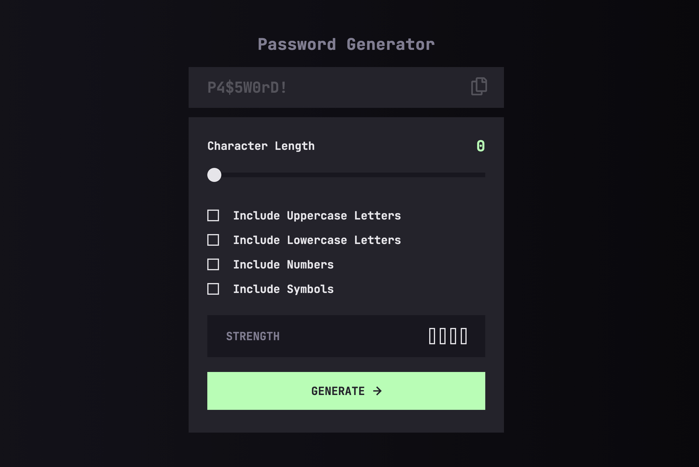

# Frontend Mentor - Password generator app solution

This is a solution to the [Password generator app challenge on Frontend Mentor](https://www.frontendmentor.io/challenges/password-generator-app-Mr8CLycqjh). Frontend Mentor challenges help you improve your coding skills by building realistic projects.

**NB!**

This Password Generator App is for practicing purposes only. It uses Math.random for the underlying generator-logic and does **NOT** comply with the strict cryptographic requirements a dedicated password-app for large scale production would follow. I might do a refactor at some point where I swap out Math.random with the Web Crypto API.

## Overview

### The challenge

Users should be able to:

- Generate a password based on the selected inclusion options
- Copy the generated password to the computer's clipboard
- See a strength rating for their generated password
- View the optimal layout for the interface depending on their device's screen size
- See hover and focus states for all interactive elements on the page

### Screenshot

### Links

- [Solution repo](https://github.com/norwegJan/Password-Generator-App)
- [Live site](https://norwegjan.github.io/Password-Generator-App/)

## My process

### Built with

- Semantic HTML5 markup
- Vanilla CSS
- CSS custom properties
- Flexbox
- Vanilla JS
- Math.random for generator logic

### What I learned

- Working with design tokens
- Browser specific styling and working with vendor prefixes (webkit VS moz)
- Introduction to password-generating logic; Awarness about Math.random vs Web Crypto API
- Working with pools
- Using the Fisher-Yates shuffle algorithm
- Working with Array.from and .slice
- Understanding of Source of Truth in programming

### What I'm proud of

How the overall functionality of the app turned out in the end. Also proud that i improved on the original design (provided by the starter Figma design file) by including error states, and a disabled state for the copy button (button is active only after each new password generation). This was functionality not included in the original design file.

### Useful resources

- [Intro to Design Tokens by Design Good Practices](https://goodpractices.design/articles/design-tokens) - Good introduction to the concept of Design Tokens.
- [WEBKIT and MOZ simplified by Deecode](https://www.youtube.com/watch?v=NQZM1C2Mf6s) - Good review of how the vendor prefixes webkit and moz works in CSS.
- [How to SHUFFLE AN ARRAY by BroCode](https://www.youtube.com/watch?v=FGAUekwri1Q) - Good explainatoion on how to shuffle an array using the Fisher-Yates algorithm

### AI Collaboration

- What tools did you use? -> I used ChatGPT Codex
- How did you use them? -> For mentor and debugging assistance (used with the agent role instruction provided in AGENTS.md)

## Author

- Website - [My GitHub Profile](https://github.com/norwegJan)
- Frontend Mentor - [@norwegJan](https://www.frontendmentor.io/profile/norwegJan)
